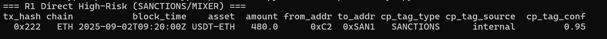

# AML Crypto Portfolio (KYT Mini Projects)

## 🔎 Quick Demo

This repo reproduces crypto AML/KYT in **10 minutes**: run rules, generate **one-pager evidence**, and prove **audit replay**.

**R1 — Direct SANCTIONS/MIXER hit**


**Evidence (auto-generated one-pager)**


**How to reproduce**
```bash
python -m venv .venv && .\.venv\Scripts\activate
pip install -U duckdb pandas
python scripts\run_kyt.py
# evidence pages -> reports\STR_cases\

Three audit-friendly, reproducible mini projects without heavy backend:
1) **KYT Rules & Casebook (SQL-first)**
2) **Travel Rule Pre-check (JSON Schema + Postman)**
3) **Audit Replay Prototype (Notebook)**

## Quickstart
1. `pip install duckdb pandas`
2. Sample CSVs in `data/raw/`
3. Run SQL in `rules/sql/`, open `notebooks/replay.ipynb` for deterministic replay.
