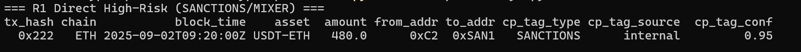
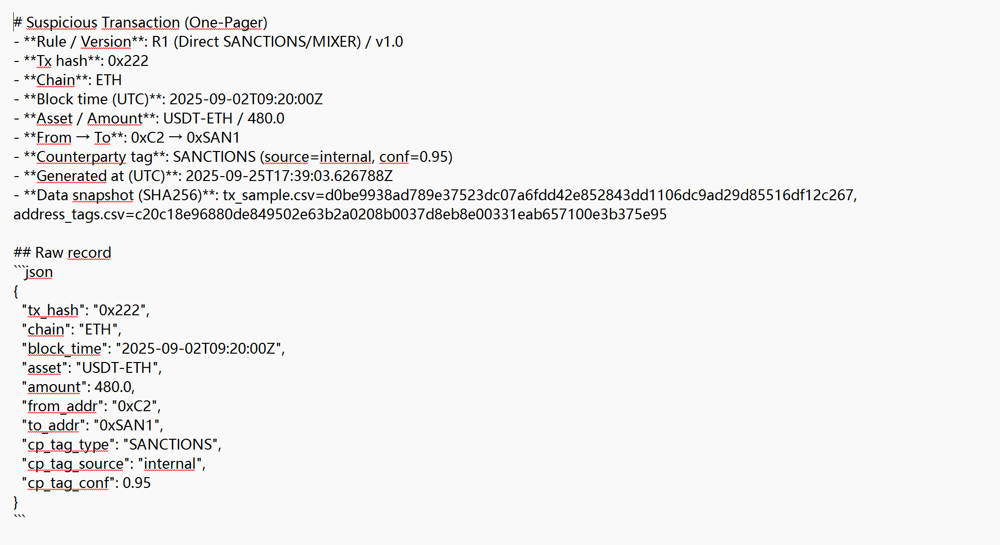

# AML Crypto Portfolio (KYT Mini Projects)

Reproducible crypto AML/KYT in **10 minutes**—run rules, generate **one-pager evidence**, and prove **audit replay**.  
Stack: Python, DuckDB, pandas, JSON/Markdown. No heavy backend.

## 🔎 Quick Demo
**R1 — Direct SANCTIONS/MIXER hit**  


**Evidence (auto-generated one-pager)**  


---

## 🚀 How to reproduce (local)
```bash
python -m venv .venv && .\.venv\Scripts\activate
pip install -U duckdb pandas
python scripts\run_kyt.py
# evidence pages -> reports\STR_cases\
